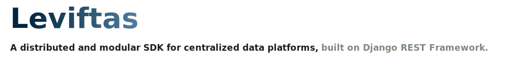

<!--
  Copyright © 2025 Leviftas authors. All rights reserved.

  Licensed under the GNU General Public License v3.0 (the "License");
  you may not use this file except in compliance with the License.
  You may obtain a copy of the License at

  https://www.gnu.org/licenses/gpl-3.0.html

  Unless required by applicable law or agreed to in writing, software
  distributed under the License is distributed on an "AS IS" BASIS,
  WITHOUT WARRANTIES OR CONDITIONS OF ANY KIND, either express or implied.
  See the License for the specific language governing permissions and
  limitations under the License.

  README.md

  

  - Author   : FrostLeo <frostleo.dev@gmail.com>
  - Created  : 2025/10/24
  - Modified : 2025/10/24
-->

<a href="https://github.com/Leviftas-Studio/Leviftas">
  <picture>
    <source media="(max-width: 768px)" srcset="docs/assets/images/readme/banner-mobile.svg">
    
  </picture>
</a>

